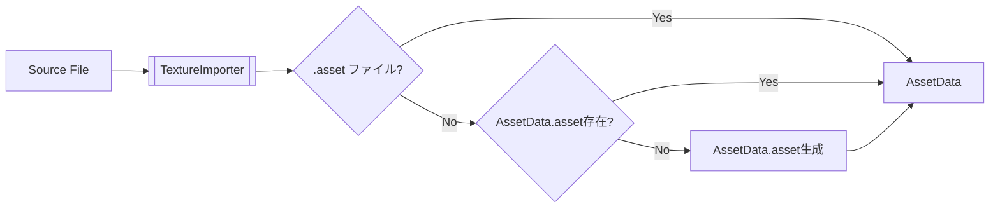

# Asset情報の規約
## ファイル規約
- jsonc(json with comment)形式で記述
- 拡張子は`.asset`

## asset情報の格納方法
### 基本情報
```jsonc
{
	"uuid": "xxxxxxxx-xxxx-xxxx-xxxx-xxxxxxxxxxxx", //!< Assetに紐図蹴られたuuid
	"type": "type", //!< Assetの種類(ex. Texture, Material, Mesh etc...)
	"metadata": {
		// 種類別のAsset情報を格納する
	}
}
```

#### 名前について
Assetの名前は, filepathのファイル名を使用する. (ex. `AssetData.asset`の名前は`AssetData`となる)

### reference(別ファイルにAsset情報)が存在する場合
```jsonc
{
	// 基本情報
	"metadata": {
		"reference": {
			"filepath": "AssetData.xxx" //!< Asset情報が存在するファイルの相対パス
			// そのほかの読み込み情報
		}
	}
}
```

### inline(内部にAsset情報)が存在する場合
```jsonc
{
	// 基本情報
	"metadata": {
		"inline": {
			// Asset情報の内容
		}
	}
}
```

## referenceに複数assetが存在する場合
(ex. gltf, animation)
- Import時にフォルダを生成し, 各Asset単位でassetファイルを生成する
```markdown
(例, gltfを読み込んだ場合)
- reference.gltf
- reference.bin
> Mesh
	- MeshXXX1.asset
	- MeshXXX2.asset
	...
> Material
	- MaterialXXX1.asset
	- MaterialXXX2.asset
	...
> Animation
	- AnimationXXX1.asset
	- AnimationXXX2.asset
	...
```

## null assetの扱い
uuidがnull(`00000000-0000-0000-0000-000000000000`)は, 読み込み中の一時AssetやMissingAssetとして使用される.
Engine側(Packages)で用意される.

## 各Assetクラス役割
- AssetMetadata
	assetファイルからの読み込み結果の格納.
	- ReferenceData
		reference情報の格納(参照先をBuildする用の設定)

	- InlineData
		inline情報の格納(Assetの情報を直接格納する)

- Asset
	Assetの基本情報の格納. (BaseAssetを継承している)

- AssetBuilder
	Assetを使用可能な状態にするためのビルド処理を行う.

## Importerの役割
Importerは、外部ファイルを読み込み、AssetDataに変換する役割を担う.

- TextureImporter
